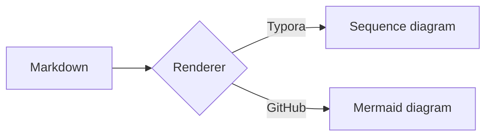
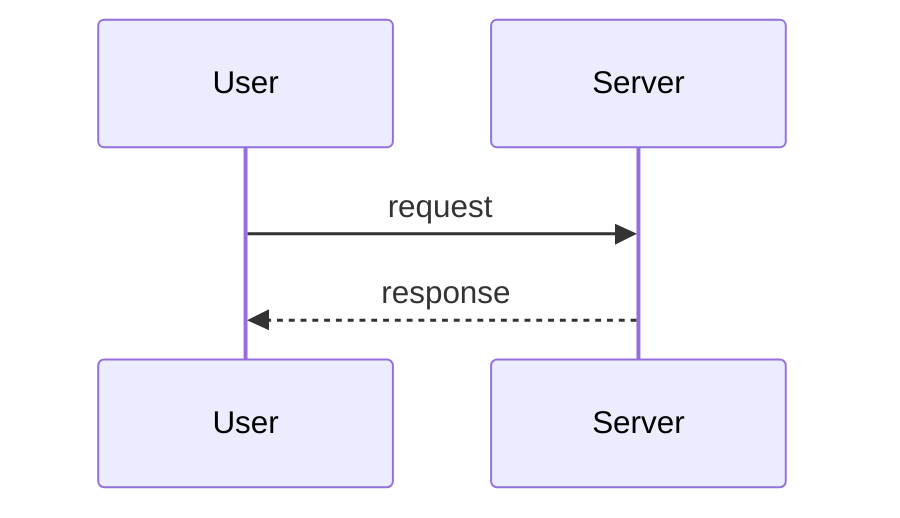

# Markdown tips

## 1. What is it / What is it for?

Markdown is a lightweight markup language for writing formatted text in plain text. It renders to HTML and is used everywhere: READMEs, docs, notes, wikis, chat.

Common uses:
- Writing formatted docs (README, notes) in plain text.
- Rendering UML-style sequence diagrams inside Typora.
- Authoring tables, lists, code blocks, and diagrams without a WYSIWYG editor.

## 2. How to download / install

Markdown itself needs no install (it is just a syntax). To *render* it you need a viewer/editor:
- **Typora** (https://typora.io/) — WYSIWYG, with built-in sequence-diagram support.
- **VS Code** — preview with the built-in Markdown preview, or the `Markdown Preview Enhanced` extension.
- **Pandoc** — convert Markdown to PDF/HTML/DOCX: `sudo apt install pandoc`.
- Basic syntax ref: https://www.jianshu.com/p/307a13c79fe4

## 3. How to use

### Headings (层级标题)

Use 1–6 `#` for heading levels. One `#` = top level (H1).

```markdown
# H1 Title
## H2 Section
### H3 Subsection
#### H4
##### H5
###### H6
```

### Emphasis (强调)

```markdown
*italic*   _italic_        (single asterisk / underscore)
**bold**   __bold__        (double)
***bold italic***          (triple)
~~strikethrough~~          (double tilde)
`inline code`              (backticks)
```

### Lists (列表)

Unordered and ordered lists; indent 2–4 spaces (or a tab) to nest.

```markdown
- parent item
  - nested item
    - deeper nested
- another parent

1. first step
2. second step
   1. sub-step
   2. sub-step
3. third step
```

Task lists (GitHub / Typora):

```markdown
- [x] done task
- [ ] pending task
- [ ] another pending
```

### Links & Images (链接与图片)

```markdown
[link text](https://example.com)
[link with title](https://example.com "hover title")


```

Reference-style links keep the body clean:

```markdown
See [the docs][1] for details.

[1]: https://example.com/docs "Documentation"
```

### Code blocks (代码块)

Fenced blocks with a language hint for syntax highlighting:

```markdown
```python
def hello():
    print("hi")
```
```

Inline code uses single backticks: `` `pip install` ``.

### Tables (图表 / 表格)

Columns separated by `|`; the second row defines alignment with `---`, `:---`, `---:`, `:---:`.

```markdown
| Feature   | Supported | Notes          |
| :-------- | :-------: | -------------: |
| Headings  | yes       | 1–6 levels     |
| Tables    | yes       | GFM / Typora   |
| Diagrams  | partial   | Typora / Mermaid |

| Alignment | Left      | Center    | Right     |
| :-------- | :-------: | --------: |
| Example   | left text | mid text  | right text|
```

> Result:
>
> | Feature   | Supported | Notes          |
> | :-------- | :-------: | -------------: |
> | Headings  | yes       | 1–6 levels     |
> | Tables    | yes       | GFM / Typora   |
> | Diagrams  | partial   | Typora / Mermaid |

### Blockquotes (引用)

```markdown
> This is a quote.
> It can span multiple lines.
>
> > Nested quote (second level).
```

### Horizontal rule (分隔线)

Use three or more `-`, `*`, or `_` on their own line:

```markdown
---
```

### Footnotes (脚注)

```markdown
Here is a statement.[^1]

[^1]: This is the footnote text.
```

### Sequence diagram (示意图 — Typora)

Typora renders a fenced `sequence` block as a UML sequence diagram:

```sequence
title: Markdown sequence
participant finefine as ff
participant kunkun as kk
ff-->kk: this is kunkun?
kk-->ff: yes!
```

Supported keywords inside the block: `title:`, `participant A as a`, `A->B: msg` (solid), `A-->B: msg` (dashed), `A->>B: msg` (open arrow), `Note left of A: text`.

### Mermaid diagrams (示意图 — GFM / VS Code)

GitHub Flavored Markdown and the VS Code `Markdown Preview Enhanced` extension render `mermaid` blocks (flowchart, sequence, gantt, etc.):

````markdown

````

````markdown

````

### Math (数学公式 — LaTeX)

Typora and many renderers support TeX via `$...$` (inline) and `$$...$$` (block):

```markdown
Inline: $E = mc^2$

Block:
$$
\int_0^1 x^2 \, dx = \frac{1}{3}
$$
```

## 4. Cheat-sheet summary

| Goal            | Syntax                                  |
| :-------------- | :-------------------------------------- |
| Heading H3      | `### Text`                              |
| Bold            | `**text**`                              |
| Inline code     | `` `code` ``                            |
| Unordered list  | `- item`                                |
| Ordered list    | `1. item`                               |
| Task list       | `- [ ] todo` / `- [x] done`             |
| Link            | `[text](url)`                           |
| Image           | ``                           |
| Table           | `\| a \| b \|` + `\| --- \| --- \|`     |
| Quote           | `> text`                                |
| Divider         | `---`                                   |
| Footnote        | `[^1]` + `[^1]: note`                   |
| Sequence diagram| ` ```sequence ` block (Typora)          |
| Mermaid diagram | ` ```mermaid ` block (GFM / VS Code)    |
| Math            | `$...$` / `$$...$$`                     |
